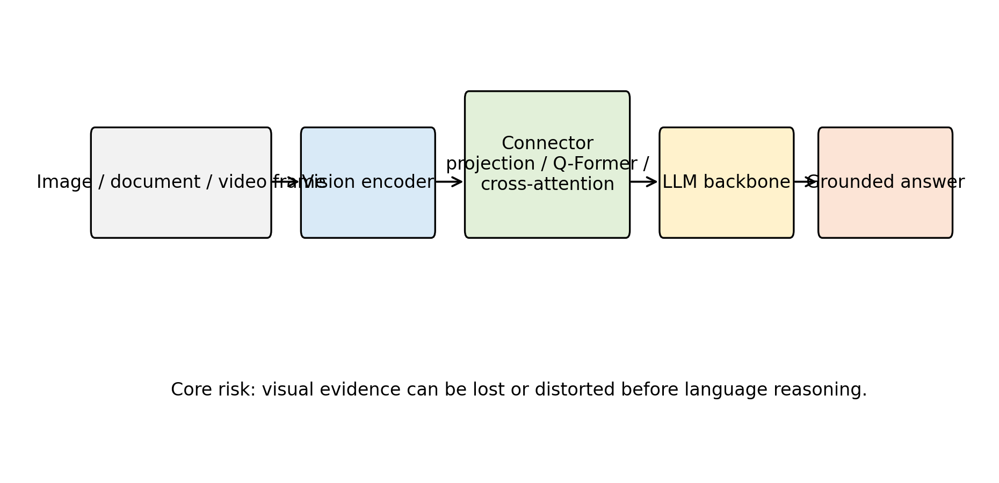
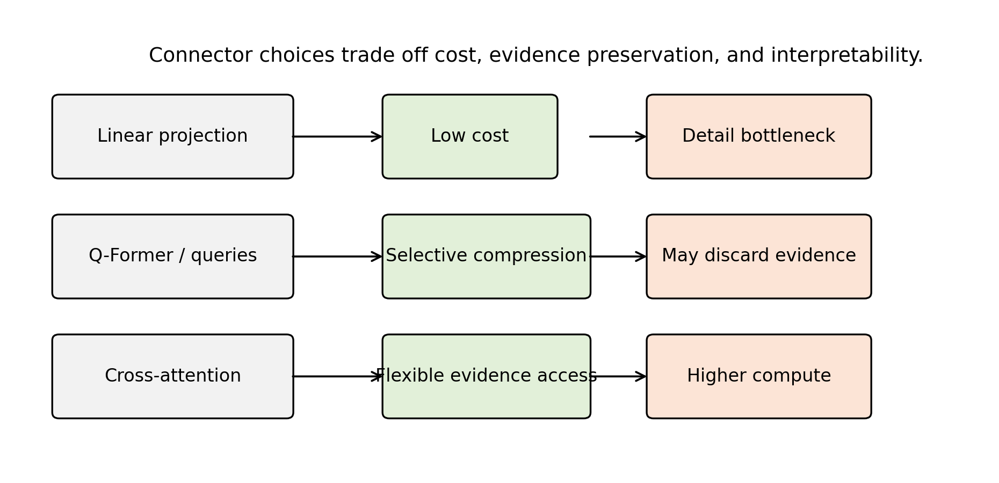
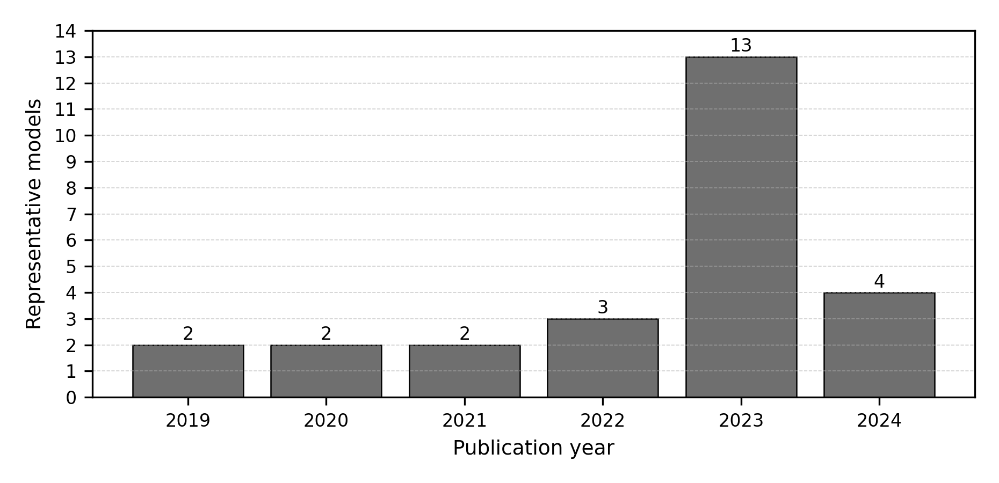
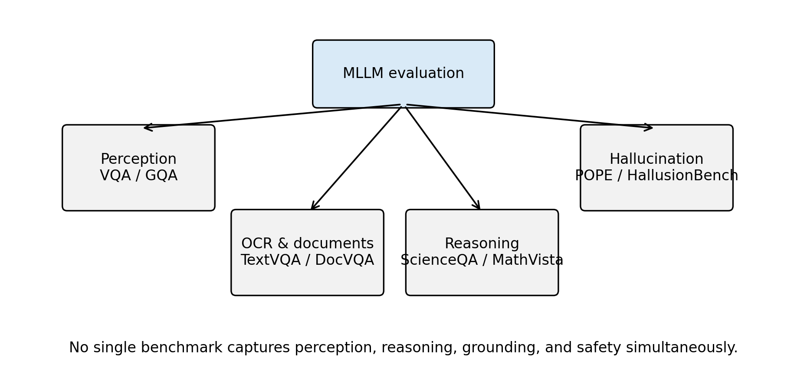
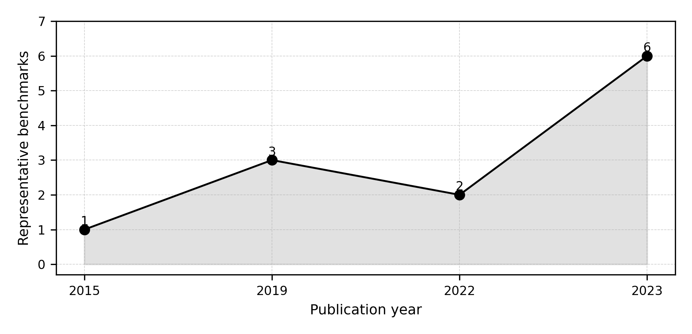
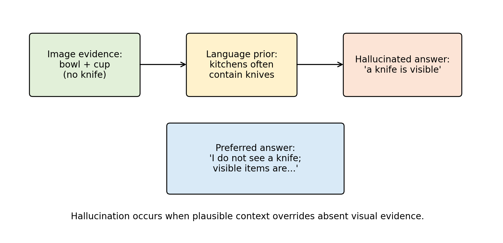
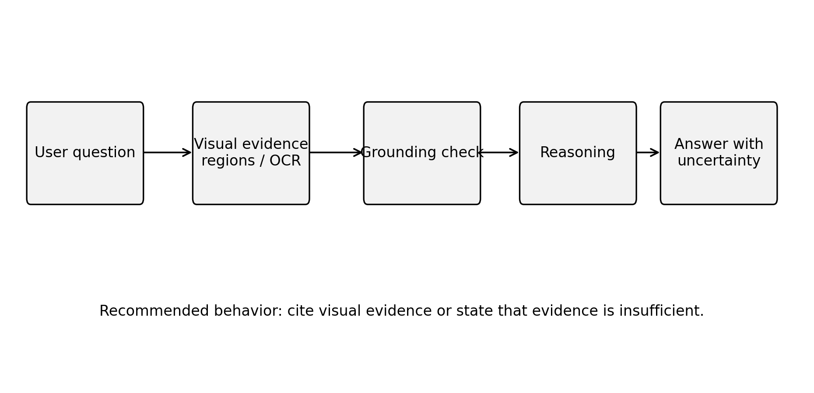

# Survey on Multimodal Intelligence: Architectures, Training Paradigms, and Evaluation of Multimodal Large Language Models

Authors: ISSA ISSA RASHID  
Student ID: 25SF51115  
Affiliation: School of Computer Science and Technology, Harbin Institute of Technology, Shenzhen, China  
Course Instructor: Dr. Kuo-Kun Tseng  
Laboratory: Advanced Artificial Intelligence Course Laboratory  
Corresponding author: ISSA ISSA RASHID, 25sf51115@stu.hit.edu.cn

## Abstract

Multimodal large language models (MLLMs) extend the reasoning, instruction-following, and generation abilities of large language models to inputs such as images, diagrams, video frames, optical text, charts, and visually grounded user instructions. Their rapid development has changed the research landscape of vision-language learning: earlier systems optimized task-specific objectives for retrieval, captioning, or visual question answering, whereas modern MLLMs attempt to serve as general interfaces between visual perception and language-based reasoning. This survey is written for the Advanced Artificial Intelligence course and connects MLLMs to structural, visual, language, generative, graph, multimodal, reinforcement, and agent intelligence. It reviews the technical foundations, architecture families, training paradigms, benchmark practices, safety issues, and reproducibility requirements of MLLMs. The discussion is organized around four central questions: how visual information is encoded, how it is connected to language models, how multimodal alignment and instruction tuning are performed, and how current benchmarks measure perception, reasoning, hallucination, and expert-domain competence. Representative systems including CLIP, Flamingo, BLIP-2, LLaVA, Qwen-VL, InternVL, CogVLM, and GPT-4V are analyzed alongside earlier vision-language pretraining models and recent grounding-oriented MLLMs. The paper does not report new model-training experiments or new benchmark scores, because no controlled benchmark execution was performed. Instead, it provides a reproducible literature and taxonomy package containing verified references, structured model and benchmark tables, generated figures, formatting scripts, and clear code-availability information. The main conclusion is that MLLM progress should be evaluated through architecture, grounding reliability, hallucination behavior, safety, benchmark transparency, and reproducibility rather than through isolated leaderboard scores.

## Keywords

Multimodal Intelligence, Large Language Models, Cross-Modal Fusion, Hallucination, Agent Intelligence

## 1. Introduction

Large language models have become general-purpose interfaces for natural-language reasoning, code generation, knowledge synthesis, and interactive problem solving. Their success depends on scaling model capacity, training data, and transformer-based sequence modeling [1], together with learning paradigms that allow a single model to generalize across many tasks from prompts or few examples [2]. However, real-world intelligence is not limited to text. Humans interpret diagrams, images, equations, maps, user interfaces, videos, charts, and physical scenes in combination with language. A model that can only process text is therefore structurally limited in domains such as scientific education, robotics, document understanding, medical image interpretation, visual programming, accessibility, and human-computer interaction.

Multimodal large language models address this limitation by coupling visual encoders, multimodal connectors, and language models. They are not merely image classifiers with text output. A capable MLLM must map visual input into a representation that a language model can reason over; preserve spatial, semantic, and symbolic details; follow natural-language instructions; avoid hallucinating nonexistent content; and maintain useful language ability after multimodal adaptation. These requirements create a complex design space. Some models use dual encoders for image-text representation learning, as in CLIP [3] and ALIGN [4]. Others use cross-attention layers, query transformers, projection modules, or visual expert modules to connect vision encoders with frozen or partially trainable language models [5] [6] [7]. A third family emphasizes instruction tuning with image-text dialogue data, as in LLaVA [8], InstructBLIP [9], MiniGPT-4 [10], and Qwen-VL [11].

The field has moved quickly because MLLMs inherit two sources of progress. From computer vision, they inherit stronger image encoders, richer pretraining corpora, and improved grounding methods. From language modeling, they inherit instruction-following behavior, chain-of-thought style reasoning, retrieval-augmented workflows, tool use, and deployment ecosystems. This combination creates impressive qualitative behavior, but it also introduces evaluation difficulties. A model may answer a question fluently while misreading the image, grounding text incorrectly, or relying on language priors. Benchmark performance can be sensitive to prompt templates, answer extraction, dataset leakage, and scoring rules. Consequently, survey work in this area must distinguish real measured evidence from demonstration claims.

This paper surveys MLLMs from the perspective of architecture, training, evaluation, and reproducibility. It focuses on models and benchmarks that have shaped the research conversation: CLIP, Flamingo, BLIP-2, InstructBLIP, LLaVA, MiniGPT-4, Qwen-VL, InternVL, CogVLM, and GPT-4V [12]. It also examines benchmark families including VQA [13], GQA [14], OK-VQA [15], ScienceQA [16], MME [17], MMBench [18], MM-Vet [19], MMMU [20], POPE [21], and MathVista [22]. Recent survey papers and community resources have also attempted to systematize this expanding field [23] [24] [25] [26]. No new benchmark scores are reported. Where benchmark names are discussed, the purpose is to explain what they evaluate and why they matter.

The contributions of this survey are fourfold. First, it provides a structured taxonomy of MLLM architectures, separating representation learning, connector-based adaptation, instruction-tuned systems, and visual-expert designs. Second, it compares training paradigms, including contrastive pretraining, generative captioning, bootstrapped alignment, visual instruction tuning, and safety alignment. Third, it analyzes benchmark categories and the practical risks of over-interpreting leaderboard numbers. Fourth, it provides a reproducible local package containing the paper draft, bibliography, taxonomy tables, and scripts for table generation and citation validation.

### Author's Analysis

This survey argues that the main research challenge in MLLMs is not simply adding images to language models. The deeper problem is how to preserve visual evidence while benefiting from the abstraction and reasoning capacity of language models. Existing evidence indicates that many impressive demonstrations still depend on fragile interactions between visual encoders, connectors, prompts, and language priors. For this reason, the paper treats architecture, grounding, evaluation, and reproducibility as one connected problem rather than as separate topics.

## 2. Theoretical Foundation: Eight Core AI Intelligence Modules

The Advanced Artificial Intelligence course is organized around eight connected intelligence modules: structural intelligence, visual intelligence, language intelligence, generative intelligence, graph intelligence, multimodal intelligence, reinforcement intelligence, and agent intelligence [27]. This survey focuses on multimodal large language models, but MLLMs depend on concepts from all eight modules. A course-aligned survey must therefore explain how MLLMs are positioned within the broader advanced AI system.

### 2.1 Structural Intelligence

Structural intelligence concerns the basic neural architectures that support modern AI systems, including neurons, activation functions, multilayer perceptrons, convolutional networks, recurrent structures, backpropagation, matrix multiplication, and optimization [27]. For MLLMs, structural intelligence provides the computational substrate: visual encoders, projection layers, attention blocks, and language backbones are all built from these general neural-network principles.

### 2.2 Visual Intelligence

Visual intelligence studies how machines perceive images and videos through CNNs, object detection, semantic segmentation, and vision transformers [27]. MLLMs inherit visual understanding from this module. A weak visual encoder limits the entire multimodal system, especially on small objects, spatial relations, OCR, diagrams, and document images. This is why MLLM research cannot be separated from progress in visual representation learning.

### 2.3 Language Intelligence

Language intelligence covers sequence modeling, self-attention, Transformer architecture, and large language models [1] [2] [27]. MLLMs rely on language intelligence for instruction following, reasoning, dialogue, and long-form generation. However, language intelligence also introduces risk: strong textual priors can cause fluent but visually unsupported answers.

### 2.4 Generative Intelligence

Generative intelligence includes VAE, GAN, diffusion models, autoregressive models, and hybrid generation paradigms [27]. MLLMs use generative modeling to produce natural-language answers and may also connect to image, video, or audio generators. Generative ability is useful only when it remains grounded in the input evidence; otherwise, it can amplify hallucination.

### 2.5 Graph Intelligence

Graph intelligence studies non-Euclidean data, graph convolutional networks, graph attention networks, and graph representation learning [27]. Although many MLLMs process images as token sequences, graph intelligence remains relevant for scene graphs, knowledge graphs, document layouts, relation extraction, and structured reasoning over entities and attributes. Scene graphs are especially useful because they represent objects, attributes, and relations explicitly, making it easier to test whether an MLLM has grounded its answer in visible evidence. They also provide a bridge between visual perception and symbolic reasoning when tasks require spatial relations, object interactions, or multi-step scene understanding.

### 2.6 Multimodal Intelligence

Multimodal intelligence is the central module of this survey. It studies how systems process and fuse text, images, audio, video, and other modalities [27]. MLLMs are a frontier form of multimodal intelligence because they connect perception modules to language models and attempt to support open-ended cross-modal reasoning.

### 2.7 Reinforcement Intelligence

Reinforcement intelligence studies agents that learn through interaction, reward, and policy optimization, including DQN, PPO, multi-agent systems, and reinforcement fine-tuning [27]. MLLMs connect to this module through reinforcement learning from human feedback, safety alignment, tool-use policies, and future embodied or interactive multimodal agents.

### 2.8 Agent Intelligence

Agent intelligence studies LLM-based systems that plan, use tools, call external resources, maintain memory, and execute workflows [27]. Modern MLLMs increasingly act as multimodal agents: they may inspect images, crop regions, read documents, query retrieval systems, call OCR tools, or control robots. This makes agent intelligence a natural extension of multimodal intelligence.

### Author's Analysis

The eight-module framework shows that MLLMs are not an isolated research topic. They are an integration point where visual intelligence supplies perception, language intelligence supplies reasoning, generative intelligence supplies output generation, structural intelligence supplies model architecture, graph intelligence supplies relational structure, reinforcement intelligence supplies alignment and interaction, and agent intelligence supplies workflow execution. This survey therefore treats MLLMs as a cross-module system rather than a single-model category.

## 3. In-Depth Investigation of the Target Direction: Multimodal Large Language Models

Research on MLLMs builds on several earlier lines of work: transformer sequence modeling, vision-language representation learning, visual question answering, image captioning, and instruction-following language models. The transformer architecture introduced self-attention as a scalable mechanism for sequence modeling [1]. Large language models later demonstrated that scaling and broad pretraining can produce strong few-shot behavior across tasks [2]. These developments supplied the language backbone used by many modern MLLMs.

Vision-language representation learning provided the second foundation. Earlier attention-based visual question answering and captioning systems highlighted the value of bottom-up visual features before the current MLLM wave [28]. Transformer-based systems such as ViLBERT, LXMERT, UNITER, Oscar, VinVL, and OFA then studied cross-modal pretraining in more unified settings [29] [30] [31] [32] [33] [34]. CLIP trained image and text encoders with a contrastive objective over image-caption pairs, producing transferable open-vocabulary visual representations [3]. ALIGN scaled a similar idea with noisy image-text supervision and showed that large web-scale data could support robust cross-modal retrieval and classification [4]. These models are not full MLLMs in the current sense because they do not perform open-ended multimodal dialogue through a generative language model. Nevertheless, they established a practical strategy: align visual and textual representations using paired data, then reuse the learned representation for downstream tasks.

A second group of works moved from retrieval-style representation learning toward generative vision-language models. BLIP unified understanding and generation with bootstrapped captions and filtering [35]. Flamingo connected strong visual encoders to frozen language models with cross-attention layers and demonstrated few-shot learning over interleaved image, video, and text inputs [5]. BLIP-2 introduced a Querying Transformer, commonly called Q-Former, to bridge frozen image encoders and frozen language models efficiently [6]. These models are important because they show that full end-to-end retraining is not the only route to multimodal competence. Careful adapter or connector design can exploit powerful unimodal components while reducing training cost.

Instruction tuning then became central. InstructBLIP adapted the BLIP-2 design toward instruction following [9]. LLaVA showed that visual instruction data could turn a vision encoder and a language model into an open multimodal assistant [8]. MiniGPT-4 provided another compact alignment recipe using a frozen visual encoder and a Vicuna-style language model [10]. These works changed the evaluation focus from task-specific metrics to interactive behavior: the model must answer questions, describe scenes, reason over diagrams, and follow user intent.

Recent systems have expanded the design space. PaLI and PaLM-E illustrate multilingual and embodied multimodal scaling [36] [37]. Kosmos-1 and Kosmos-2 emphasize aligning perception with language and grounding multimodal language models to the world [38] [39]. Qwen-VL emphasizes abilities such as text reading and localization in addition to general visual dialogue [11]. mPLUG-Owl, Shikra, Ferret, VILA, Video-LLaVA, and Visual ChatGPT represent additional directions in modularization, referential dialogue, grounding, pretraining, video alignment, and tool-assisted visual interaction [40] [41] [42] [43] [44] [45]. InternVL studies scaling of vision foundation models and alignment for generic visual-linguistic tasks [46]. CogVLM uses a visual expert approach to integrate visual capability into pretrained language models while preserving language competence [7]. GPT-4V represents a closed frontier system described through a system card rather than full open model weights or training details [12]. The contrast between open and closed systems is now a major reproducibility issue: closed systems can be evaluated externally, but their training data, architecture, and alignment processes cannot be independently inspected.

Additional recent work broadens the field beyond still-image chat. GPT-4 and Gemini show the role of frontier-scale multimodal or multimodal-adjacent systems [47] [48]. OpenFlamingo and IDEFICS/OBELICS emphasize reproducible or openly described training infrastructure and interleaved image-text corpora [49] [50]. ImageBind explores shared embeddings across multiple modalities [51], while NExT-GPT, LLaMA-VID, and Video-ChatGPT extend the discussion toward any-to-any multimodality and video understanding [52] [53] [54]. Model composition research further asks whether separately trained multimodal experts can be combined rather than retrained from scratch [55].

Evaluation research has also evolved. Early visual question answering benchmarks such as VQA [13], GQA [14], OK-VQA [15], A-OKVQA, and CLEVR tested specific combinations of perception, language, compositional reasoning, and external knowledge [56] [57]. TextVQA, DocVQA, and ChartQA extended evaluation toward visual text reading, document images, and chart reasoning [58] [59] [60]. ScienceQA introduced science-question reasoning with multimodal explanations [16]. Modern MLLM benchmarks such as MME, MMBench, MM-Vet, MMMU, SEED-Bench, and HallusionBench attempt to measure broader capability dimensions, generative comprehension, and hallucination or visual-illusion behavior [17] [18] [19] [20] [61] [62]. POPE focuses specifically on object hallucination [21], while MathVista evaluates mathematical reasoning in visual contexts [22]. This benchmark expansion reflects a key point: no single test can characterize an MLLM.

This survey also includes a HITSZ-linked grounded evaluation perspective. CulturALL includes Wenjiang Luo among the authors and lists Baotian Hu with Harbin Institute of Technology, Shenzhen affiliation; it benchmarks multilingual and multicultural competence on grounded tasks [63]. This is relevant because MLLM evaluation is increasingly concerned not only with object recognition and English visual question answering, but also with cultural grounding, multilingual robustness, and task settings where visual or contextual evidence must be interpreted carefully.

### Author's Analysis

The related literature suggests a transition from task-specific vision-language systems to general multimodal interfaces. However, the transition is incomplete. Many open systems inherit strong image encoders and language models, but their connectors and training data often determine whether the final system is genuinely grounded. The literature also shows a reproducibility divide: open models support inspection and ablation, while frontier closed systems influence expectations but cannot be scientifically reproduced from public information alone.

### 3.1 Technical Foundation of Multimodal Large Language Models

An MLLM can be viewed as a conditional sequence model that generates text given multimodal context. Let an image or set of images be denoted by \(x_v\), a textual prompt by \(x_t\), and the target textual response by \(y = (y_1, ..., y_T)\). A generative MLLM models

\[
p(y | x_v, x_t) = \prod_{i=1}^{T} p(y_i | y_{<i}, x_t, f_v(x_v)),
\]

where \(f_v\) is a visual encoder or visual representation module. The central design problem is how to transform \(f_v(x_v)\) into representations compatible with the token-based language model. Different MLLM families answer this problem differently.

In a dual-encoder contrastive model, an image encoder \(f_v\) and a text encoder \(f_t\) map inputs into a shared embedding space. Given paired examples \((x_v^i, x_t^i)\), a contrastive loss increases similarity for matched pairs and decreases similarity for mismatched pairs. This approach supports retrieval and open-vocabulary classification, but it does not by itself generate long-form answers. CLIP is the canonical example [3]. Its importance for MLLMs lies in the learned visual representation and image-text alignment, which can be reused in later systems.

Connector-based MLLMs add an interface between visual features and a language model. Let \(h_v = f_v(x_v)\) be a sequence or grid of visual features. A connector \(g\) maps visual features into a sequence of embeddings \(z_v = g(h_v)\) compatible with the language model token embedding space. The language model then receives a combined sequence such as \([z_v; e(x_t)]\), where \(e(x_t)\) denotes text token embeddings. The connector may be a linear projection, multilayer perceptron, cross-attention module, Q-Former, or more elaborate visual expert. Linear projections are simple and efficient, but they may bottleneck spatial and symbolic detail. Query-based connectors can compress visual features into a fixed number of learned queries, improving efficiency but potentially discarding fine-grained evidence. Cross-attention layers allow the language model to attend to visual states more flexibly, but they increase architectural complexity.

Instruction tuning changes the learning objective. Instead of only predicting captions or matching image-text pairs, the model is trained on examples of the form \((image, instruction, answer)\). The supervised objective is usually next-token prediction over the answer. This procedure aligns the model with conversational behavior and user intent. However, instruction data quality is critical. If the instruction data contains overconfident answers, weak grounding, or synthetic artifacts, the model may learn to respond fluently without adequate visual evidence. The risk is especially serious for hallucination, where a model mentions objects, text, or relations that are not present in the image.

The theoretical tension in MLLMs is therefore between compression and grounding. Visual input is high-dimensional and often spatially structured. Language models operate over token sequences and learn strong textual priors. A model must compress images enough for efficient reasoning but not so aggressively that it loses fine details. It must exploit language knowledge without allowing language priors to override visual evidence. It must learn instruction-following behavior without treating every prompt as an invitation to invent plausible content. Many current limitations follow from this tension.

### Author's Analysis

The most important theoretical issue is the visual-token bottleneck. A model cannot reason over evidence that has been discarded before the language model receives it. This survey therefore views connectors not as minor engineering components but as epistemic filters: they decide what the language model is allowed to know about the image. Future theory should explain not only how to align modalities, but also how to measure information loss, uncertainty, and evidence faithfulness during visual-to-language transfer.

Figure 1. General MLLM architecture and information-flow bottleneck showing the visual encoder, connector, and language model components.



### 3.2 Survey Methodology

### 3.2.1 Problem Definition

This paper studies MLLMs as systems that accept one or more visual inputs and natural-language prompts, then produce natural-language outputs that are intended to be grounded in the visual input. The survey asks four research questions:

1. What architecture patterns dominate current MLLMs?
2. What training and alignment paradigms are used to connect vision and language?
3. What benchmark families evaluate perception, reasoning, hallucination, and expert-domain ability?
4. What reproducibility practices are necessary for trustworthy MLLM research?

The paper is a literature survey and taxonomy study. It does not train a model, fine-tune a model, evaluate a benchmark, or report new scores. This choice is deliberate: the available local project does not include model weights, benchmark datasets, compute logs, or executed experiment outputs. Reporting new numbers without execution would violate reproducibility requirements.

### 3.2.2 Literature Selection

The paper prioritizes real references from major venues and widely cited technical reports or arXiv preprints that shaped the MLLM field. The selected works cover foundational transformers, large language model scaling, contrastive vision-language learning, generative vision-language pretraining, instruction-tuned MLLMs, closed frontier multimodal systems, and multimodal benchmarks. The bibliography is stored in `paper/references.bib`, and citation keys in the manuscript can be checked with `scripts/validate_references.py`.

The selection is not exhaustive. MLLMs are a rapidly moving field, and many new models appear as technical reports before peer review. For that reason, this survey emphasizes stable conceptual categories rather than a complete leaderboard. Future extensions should add references only after verifying bibliographic details and should distinguish peer-reviewed papers from preprints and system cards.

### 3.2.3 Taxonomy Construction

Two taxonomy tables are included. The model taxonomy records representative systems, publication year, architecture pattern, training or alignment paradigm, and notable role. The benchmark taxonomy records benchmark year, primary focus, and typical use in MLLM evaluation. These tables are stored as CSV files in `paper/tables/` and can be regenerated as Markdown tables by running:

```bash
python scripts/generate_tables.py
```

This design makes the survey easier to audit. Instead of manually editing tables in the paper, future work can update structured CSV files and regenerate consistent output.

### 3.2.4 Implementation Details

Because this is a survey paper, there are no model-training hyperparameters such as optimizer, learning rate, batch size, epochs, or weight decay. If future original experiments are added, those fields must be specified exactly. For the current reproducibility package, the implementation details are:

- Programming language: Python 3.11
- Required package: PyYAML for configuration compatibility
- Scripts: `generate_tables.py` and `validate_references.py`
- Hardware: CPU-only execution is sufficient for the included scripts
- Random seed: not applicable because no stochastic experiment is executed
- Software environment: specified in `requirements.txt` and `environment.yml`

### Author's Analysis

The methodology is intentionally conservative. It does not attempt to produce a leaderboard because no models were executed under controlled conditions. This is a strength rather than a weakness for a survey paper: it prevents unsupported empirical claims and focuses the contribution on organization, comparison, and reproducibility. The main limitation of the method is that qualitative comparison depends on the quality and representativeness of selected literature, so the bibliography must remain transparent and updateable.

## 4. Comparative Analysis and Frontier Research Progress

### 4.1 Architecture Taxonomy: Contrastive Representation Models

Contrastive vision-language models learn aligned image and text spaces. CLIP is the most influential example [3]. It trains image and text encoders so that matching image-caption pairs have high similarity and mismatched pairs have low similarity. This objective enables zero-shot image classification by comparing an image embedding to text prompts representing class names. ALIGN follows a related strategy at larger noisy-data scale [4].

The strength of contrastive models is transferability. They produce visual representations that can support classification, retrieval, and downstream multimodal systems. Their weakness is generative limitation. A dual encoder does not naturally produce a paragraph-length answer, a dialogue response, or a step-by-step explanation. For that reason, contrastive models often serve as components inside broader MLLMs rather than complete assistants.

### 4.2 Architecture Taxonomy: Generative Vision-Language Pretraining

BLIP introduced bootstrapping methods for unified vision-language understanding and generation [35]. Its core insight is that noisy web captions can be improved through caption generation and filtering, producing better supervision for downstream learning. This line of work bridges the gap between static representation learning and text generation.

Flamingo is a major step toward general-purpose multimodal generation [5]. It connects visual inputs to a language model with gated cross-attention and supports interleaved image/video and text inputs. The model's few-shot framing is important because it treats visual tasks as promptable problems rather than fixed-output classifiers. However, Flamingo is not fully open in the sense of public weights and training data, which limits independent reproduction.

### 4.3 Architecture Taxonomy: Frozen-Backbone Connector Models

Frozen-backbone designs reduce training cost by keeping strong unimodal components fixed. BLIP-2 is central in this category [6]. It uses a Q-Former to query visual features and connect them to a frozen language model. This approach recognizes that high-quality image encoders and language models already contain substantial knowledge; the challenge is learning an efficient bridge between them.

The advantage is efficiency and modularity. Researchers can update the visual encoder, connector, or language model independently. The disadvantage is that connector capacity becomes a bottleneck. If the connector cannot preserve fine-grained visual details, the language model may answer from priors rather than evidence. This is particularly problematic for OCR, counting, small objects, spatial relations, and chart interpretation.

### 4.4 Architecture Taxonomy: Instruction-Tuned Open MLLMs

Instruction tuning adapts MLLMs to interactive user behavior. LLaVA is a representative open system that combines a vision encoder, projection layer, language model, and visual instruction data [8]. MiniGPT-4 follows a related goal of aligning a visual encoder with a capable language model through a compact training recipe [10]. InstructBLIP extends BLIP-2 toward general-purpose instruction following [9].

The main benefit is usability. Users can ask natural questions about images and receive natural-language answers. The main risk is superficial fluency. A model may learn the style of helpful answers without robust grounding. Instruction tuning therefore requires careful data construction, visual grounding checks, and hallucination evaluation.

### 4.5 Architecture Taxonomy: Expanded Capability Models

Qwen-VL extends the open MLLM landscape with attention to localization, text reading, and broader multimodal tasks [11]. InternVL studies scale in vision foundation models and alignment for generic vision-language tasks [46]. CogVLM introduces a visual expert design to add visual capability while preserving language ability [7]. These systems show that MLLM architecture is not converging to one simple pattern. Instead, the field is testing several hypotheses about how to best preserve both visual detail and language competence.

Closed frontier systems such as GPT-4V also influence the field [12]. They provide evidence that high-capability multimodal assistants are possible, but their closed nature creates evaluation and reproducibility limits. Researchers can test inputs and outputs, but they cannot inspect training data, architecture, alignment methods, or internal error causes. This makes open systems essential for scientific analysis even when closed systems may perform strongly.

### 4.6 Cross-Cutting Architecture Trade-Offs

Across model families, the central architecture problem is evidence preservation. Visual encoders must retain fine-grained information for OCR, spatial relations, charts, diagrams, and counting. Connectors then decide how much of that evidence reaches the language model. A linear projection is efficient but may lose detail; Q-Former-style query modules are selective but can discard unexpected evidence; cross-attention is expressive but more expensive; visual-expert modules improve specialization but increase complexity.

The language backbone supplies fluency, world knowledge, and reasoning, but it also introduces priors that can override weak visual evidence. This is why open and closed systems must be evaluated differently. Open models support inspection, ablation, and reproducible error analysis. Closed models may provide strong capability baselines, but their architecture, data, and alignment procedures cannot be independently verified. For a course survey, open reproducible systems are therefore more scientifically useful even when closed systems are practically influential.

### Author's Analysis

Architecture design in MLLMs is a sequence of trade-offs. A simple projection connector is cheap but can lose visual detail. A query transformer improves selectivity but may hide what evidence was discarded. Cross-attention is expressive but expensive. Visual-expert modules preserve specialized perception but add system complexity. This survey argues that future architectures should be judged by evidence preservation, controllability, and auditability, not only by benchmark rank.

Table 1a. Representative MLLM architecture and openness comparison.

| Model | Year | Vision Encoder | LLM Backbone | Connector | Open Source |
| --- | --- | --- | --- | --- | --- |
| CLIP | 2021 | ResNet or Vision Transformer | Text encoder | Contrastive shared embedding | Yes |
| Flamingo | 2022 | Perceiver-style visual resampler | Chinchilla-family language model | Gated cross-attention | No |
| BLIP-2 | 2023 | Frozen image encoder | Frozen LLM | Q-Former | Yes |
| InstructBLIP | 2023 | Frozen image encoder | Vicuna or FlanT5-style LLM | Q-Former with instruction tuning | Yes |
| LLaVA | 2023 | CLIP ViT | Vicuna-style LLM | Linear projection | Yes |
| MiniGPT-4 | 2024 | Vision Transformer with Q-Former | Vicuna-style LLM | Linear projection after Q-Former | Yes |
| Qwen-VL | 2023 | Vision-language encoder | Qwen language model | Multimodal adapter | Partly |
| InternVL | 2024 | Scaled vision foundation model | LLM backbone | Vision-language alignment module | Yes |
| CogVLM | 2024 | Visual expert module | Pretrained language model | Visual expert integration | Yes |
| GPT-4V | 2023 | Not publicly disclosed | Not publicly disclosed | Not publicly disclosed | No |
| Gemini | 2023 | Not fully public | Not fully public | Native multimodal system design | No |
| Ferret | 2024 | Vision encoder with region grounding | LLM backbone | Grounding-aware connector | Yes |

Table 1b. Representative MLLM resource demand, scenario, and limitation comparison.

| Model | Complexity and Resource Demand | Applicable Scenario | Major Strength | Major Weakness |
| --- | --- | --- | --- | --- |
| CLIP | Moderate inference cost; dual encoder retrieval/classification | Open-vocabulary retrieval and representation learning | Strong open-vocabulary image-text alignment | Not a generative conversational MLLM |
| Flamingo | Very high training and inference resource demand | Few-shot image/video-text tasks | Strong few-shot interleaved image/video-text learning | Closed weights and limited reproducibility |
| BLIP-2 | Lower training cost than full end-to-end MLLM | Efficient image-to-text generation and VQA | Efficient bridge between vision encoders and LLMs | Connector may compress away fine visual detail |
| InstructBLIP | Moderate adaptation cost; depends on LLM scale | Instruction-following visual QA and dialogue | Better instruction following than BLIP-2 | Still sensitive to instruction-data quality |
| LLaVA | Relatively efficient open alignment recipe | Open visual assistant baseline | Simple and influential open visual instruction tuning baseline | Can hallucinate when visual grounding is weak |
| MiniGPT-4 | Moderate cost with frozen components | Image dialogue and demonstration systems | Compact alignment recipe for image dialogue | Limited fine-grained grounding and OCR reliability |
| Qwen-VL | High capability with significant pretraining resources | OCR localization and visual dialogue | Good OCR localization and general visual dialogue | Training details and data scale are difficult to fully reproduce |
| InternVL | High resource demand due to scale | Generic visual-linguistic tasks | Strong generic visual-linguistic capability | Large-scale training makes reproduction costly |
| CogVLM | High architectural complexity and memory demand | Visual expert reasoning and open MLLM research | Preserves language ability while adding visual expertise | Architecture is more complex than projection-based models |
| GPT-4V | Unknown but likely very high | Frontier closed multimodal assistant | High-capability frontier multimodal assistant | Closed architecture data and training process |
| Gemini | Unknown but likely very high | Frontier multimodal applications | Strong frontier multimodal model family | Closed training details limit independent analysis |
| Ferret | Moderate to high due to region grounding | Referential dialogue and spatial grounding | Supports referring and grounding at flexible granularity | Requires reliable region-level annotation and grounding |

Table 2. Representative MLLM architecture taxonomy.

| stage | examples | main pattern | role in survey |
| --- | --- | --- | --- |
| Pre-LLM VLP | ViLBERT, LXMERT, UNITER, Oscar, VinVL | cross-modal encoder pretraining | foundation for image-text representation learning |
| Open-vocabulary alignment | CLIP, ALIGN, OFA, PaLI | contrastive or sequence-to-sequence scaling | transferable visual-language representations |
| Frozen-connector MLLMs | Flamingo, BLIP-2, MiniGPT-4 | vision encoder connected to frozen or partly frozen LLM | efficient multimodal generation and few-shot adaptation |
| Instruction-tuned MLLMs | InstructBLIP, LLaVA, Qwen-VL, mPLUG-Owl | visual instruction tuning and alignment | assistant-style multimodal interaction |
| Grounded and visual-expert MLLMs | Kosmos-2, Shikra, Ferret, CogVLM, InternVL | grounding, localization, expert modules, and scale | fine-grained visual evidence and grounding reliability |
| Expanded modality systems | PaLM-E, Video-LLaVA, Visual ChatGPT, GPT-4V | embodiment, video, tool use, or closed frontier alignment | broader deployment and reproducibility trade-offs |

Figure 2. Connector trade-offs in MLLM design.



Figure 3. Timeline distribution of representative MLLM-related models.



### 4.7 Training Paradigms

### 4.7.1 Image-Text Contrastive Pretraining

Contrastive pretraining aligns images and text at the representation level. It is scalable, works with large noisy image-caption datasets, and supports retrieval and classification. Its limitation is that it usually captures global correspondence rather than detailed reasoning. For example, matching an image with a caption does not require the model to count objects accurately, read small text, or reason through a diagram. Contrastive pretraining is therefore a strong foundation but not a complete solution.

### 4.7.2 Captioning and Generative Pretraining

Generative pretraining teaches models to produce text from visual input. Captioning encourages the model to describe salient objects, attributes, and relations. However, captions are often incomplete. A caption may ignore details that are crucial for a later question. If a model is trained primarily on captions, it may underperform on tasks that require reading text, locating small objects, or answering unusual questions. BLIP-style bootstrapping addresses part of this issue by improving caption quality [35].

### 4.7.3 Connector Alignment

Connector alignment trains a module that maps visual features into the language model's input space. This is computationally attractive because the large language model can remain frozen. BLIP-2 is an important example [6]. The key question is what information the connector preserves. A small projection may be efficient but lossy. A query transformer can learn task-relevant summaries but may miss details outside its learned query capacity. Cross-attention can be expressive but computationally heavier.

### 4.7.4 Visual Instruction Tuning

Visual instruction tuning uses multimodal conversations or question-answer pairs. LLaVA demonstrated the effectiveness of this approach for creating open visual assistants [8]. InstructBLIP refined instruction tuning in a BLIP-style architecture [9]. The training data may include human-written examples, synthetic examples generated by stronger models, or mixtures of task datasets reformatted as instructions.

The strength of instruction tuning is behavioral alignment. It teaches the model to respond in a way users expect. The weakness is dependency on data quality. If training examples contain ungrounded claims, models can learn to hallucinate. If examples overrepresent certain domains, models may fail in underrepresented visual styles. If synthetic data is generated by a closed model, errors and biases may transfer into the open model.

Parameter-efficient and feedback-based alignment methods also influence how open MLLMs are adapted. LoRA and QLoRA reduce the cost of fine-tuning large backbones by updating low-rank or quantized adaptation parameters rather than all weights [64] [65]. Human-feedback instruction following, developed first in text-only settings, remains relevant because multimodal assistants must learn when to answer, refuse, or express uncertainty [66]. Reasoning-oriented prompting and multimodal chain-of-thought studies further show why MLLM outputs should be evaluated for reasoning quality, not only final answer strings [67] [68].

### Author's Analysis

Training paradigms reveal a tension between scale and supervision quality. More image-text data can improve coverage, but weak captions rarely teach exact grounding, OCR, or uncertainty. Instruction tuning improves usability but can teach a model to sound confident even when the visual evidence is weak. This survey argues that the next stage of MLLM training should combine scalable pretraining with explicit evidence supervision, uncertainty calibration, and negative examples where the correct response is to refuse or state that the image is insufficient.

### 4.7.5 Safety and Refusal Alignment

MLLMs introduce safety problems beyond text-only systems. A visual model may answer questions about people, medical images, identity, documents, or dangerous physical procedures. Safety alignment must consider both the text prompt and the visual content. GPT-4V's system card emphasizes safety evaluation and deployment considerations for visual inputs [12]. Open research still needs stronger public benchmarks for visual privacy, sensitive inference, medical uncertainty, and malicious multimodal prompting.

### 4.8 Benchmark Evaluation and Comparative Analysis

### 4.8.1 Classical VQA Benchmarks

VQA introduced open-ended question answering over images [13]. It remains historically important because it framed visual understanding as language-conditioned prediction. However, early VQA datasets can contain language biases, making it possible for models to answer some questions from text priors alone. GQA was designed to emphasize compositional reasoning and scene-graph structure [14]. OK-VQA requires external knowledge beyond visible image content [15]. Together, these benchmarks show that visual question answering is not a single skill: it may require perception, language priors, compositional reasoning, and world knowledge.

### 4.8.2 Educational and Scientific Reasoning

ScienceQA evaluates multimodal science-question reasoning and explanations [16]. It is relevant because scientific tasks often combine text, diagrams, symbolic notation, and commonsense knowledge. MLLMs are attractive for education because they can potentially explain visual material, but this also raises risks. An incorrect explanation can be more harmful than a simple wrong label because it may appear authoritative. Therefore, education-oriented benchmarks should evaluate not only answer correctness but also reasoning quality and uncertainty.

### 4.8.3 Broad MLLM Diagnostic Benchmarks

MME provides a broad diagnostic benchmark for perception and cognition in MLLMs [17]. MMBench asks whether multimodal models are all-around players and emphasizes systematic evaluation [18]. MM-Vet evaluates integrated capabilities, recognizing that real tasks often require multiple skills at once [19]. These benchmarks are useful because they move beyond narrow datasets. However, they should not be treated as complete measures of intelligence. Benchmark construction choices, answer formats, prompt templates, and model-specific preprocessing can influence outcomes.

### 4.8.4 Expert-Domain and Mathematical Reasoning

MMMU evaluates expert-level multimodal understanding across disciplines [20]. MathVista focuses on mathematical reasoning in visual contexts [22]. These benchmarks are important because many practical applications require more than object recognition. A model must interpret charts, diagrams, geometric relations, equations, and domain-specific terminology. Such tasks stress both visual parsing and symbolic reasoning. They also reveal the limitations of language priors: a fluent explanation is not enough if the model misreads a graph or diagram.

### 4.8.5 Hallucination Evaluation

Hallucination is a central MLLM failure mode. POPE evaluates object hallucination by probing whether models assert the presence of objects not in the image [21]. This problem is structurally connected to language-model priors. If a model sees a kitchen, it may mention common kitchen objects even when they are absent. If it sees a street, it may infer traffic signs or vehicles from context. Such behavior is dangerous in settings where visual evidence matters, including medicine, inspection, navigation, and legal documents.

Hallucination evaluation should separate several cases: nonexistent object mentions, incorrect attributes, wrong spatial relations, false OCR, unsupported causal explanations, and overconfident domain claims. A benchmark that only checks object presence cannot capture all hallucination types. Future evaluation should also test whether models can say "not visible", "uncertain", or "the image does not provide enough evidence" when appropriate.

Table 3. Representative MLLM benchmark taxonomy.

| Benchmark Group | Examples | Primary Capability | Evaluation Risk |
| --- | --- | --- | --- |
| General VQA | VQA, GQA, OK-VQA | image-conditioned question answering | language priors and dataset bias |
| OCR and Chart Reasoning | TextVQA, ChartQA, DocVQA | Reading scene text and structured graphics | Small text, chart parsing, and answer normalization |
| Science and Mathematics | ScienceQA, MathVista | Diagram-grounded and visual mathematical reasoning | Fluent but unsupported reasoning |
| Broad diagnostics | MME, MMBench, MM-Vet | perception, cognition, and integrated skills | prompt sensitivity and scoring differences |
| Hallucination | POPE, HallusionBench | Detecting unsupported object claims and illusions | Coverage beyond object presence remains limited |
| Expert-Domain Reasoning | MMMU | College-level multidisciplinary multimodal reasoning | Contamination and domain coverage |

Figure 4. Benchmark taxonomy for MLLM evaluation.



Figure 5. Timeline distribution of representative MLLM benchmarks.



### 4.8.6 Comparative Analysis Without Fabricated Scores

This survey intentionally does not provide a leaderboard. A valid leaderboard requires controlled execution, exact model versions, prompts, decoding parameters, datasets, and scoring scripts. Without these details, benchmark numbers can be misleading. Even numbers copied from source papers must be interpreted carefully because models may have different training data, evaluation preprocessing, and prompt formats.

Qualitatively, the literature supports several defensible comparisons. Contrastive models such as CLIP are strong representation learners but are not full conversational MLLMs [3]. Flamingo and BLIP-2 demonstrate that frozen components and learned connectors can produce strong multimodal generation and few-shot adaptation [5] [6]. LLaVA and InstructBLIP show that instruction tuning is essential for assistant-like behavior [8] [9]. Qwen-VL, InternVL, and CogVLM represent later efforts to expand grounding, scale, and visual expertise [11] [46] [7]. Closed systems such as GPT-4V remain important external references but cannot be fully reproduced from public information [12].

### 4.8.7 Benchmark Design Risks

Benchmark design strongly shapes research conclusions. A benchmark that uses multiple-choice questions may be easy to score, but it can reward test-taking strategies. A model may eliminate unlikely options using language priors rather than interpreting the image. Conversely, an open-ended benchmark may better reflect real user interaction, but automatic scoring becomes difficult because many correct answers may be phrased differently. Human evaluation can help, but it is expensive and may introduce annotator disagreement.

Prompt sensitivity is another major risk. An MLLM may answer differently when asked "What is in the image?", "Describe the image carefully", or "Answer with one word." Some benchmarks provide fixed prompts, while others leave prompt choice to evaluators. If prompt templates differ across papers, results cannot be compared directly. Decoding settings also matter. Greedy decoding, beam search, temperature sampling, and maximum-token limits can change outputs. Therefore, a reproducible benchmark report should specify prompt templates, answer extraction rules, decoding parameters, image preprocessing, model checkpoint, and scoring code.

Dataset contamination is especially difficult for MLLMs. Large-scale web training may include benchmark images, questions, answers, or near duplicates. Even if exact benchmark data is absent, related examples may be present. Contamination can inflate performance and make it unclear whether the model learned general reasoning or memorized patterns. Stronger reporting should include contamination checks where possible, such as near-duplicate image search, text overlap analysis, and evaluation on newly collected private or time-separated data.

Another risk is benchmark narrowness. A model can score well on common object recognition but fail at medical images, satellite imagery, engineering diagrams, or local cultural contexts. A model can answer English visual questions but fail multilingual instructions. A model can perform well on static images but fail video sequences requiring temporal reasoning. For this reason, benchmark results should be interpreted as evidence about the tested distribution, not universal ability.

### 4.8.8 Error Taxonomy for MLLMs

A useful evaluation framework should classify errors, not only count them. In MLLMs, errors often arise from different sources. Perception errors occur when the model fails to detect visible objects, text, attributes, or spatial relations. Grounding errors occur when the model identifies a correct concept but attaches it to the wrong region or entity. Reasoning errors occur when visual evidence is parsed correctly but the conclusion is wrong. Knowledge errors occur when the task requires external facts and the language model supplies incorrect knowledge. Instruction-following errors occur when the answer does not match the requested format or scope. Safety errors occur when the model provides harmful, privacy-invasive, or overconfident responses.

This taxonomy matters because different interventions address different errors. A better visual encoder may reduce perception errors but not reasoning errors. More instruction tuning may improve format compliance but increase hallucination if the data is weakly grounded. External OCR tools may improve text reading but not general spatial reasoning. Safety tuning may reduce harmful answers but not improve visual accuracy. Without error categorization, researchers may select the wrong solution for the observed failure.

The most dangerous errors are often plausible. If a model gives an obviously nonsensical answer, users may distrust it. If it gives a fluent, detailed, but unsupported explanation, users may accept it. This is why hallucination and calibration should be evaluated together. A reliable MLLM should know when visual evidence is insufficient and should express uncertainty in a way that users can understand.

### 4.8.9 Reproducible Evaluation Protocol

A controlled future experiment for this project could follow a transparent protocol. First, select open models with fixed released checkpoints. Second, record exact model identifiers, commit hashes, dependencies, and licenses. Third, download benchmarks from official sources and store checksums or version identifiers. Fourth, use a fixed image preprocessing pipeline. Fifth, define prompts in a configuration file rather than hard-coding them. Sixth, run inference with fixed decoding settings. Seventh, save raw model outputs before scoring. Eighth, score with released scripts or clearly documented local scripts. Ninth, report both aggregate metrics and representative error cases. Tenth, publish the full logs and configuration files.

Such a protocol would allow the paper to include quantitative results in a future version. Until then, the correct scientific choice is to avoid benchmark numbers. The current paper therefore provides taxonomy and analysis only.

### Author's Analysis

The benchmark literature suggests that MLLM evaluation is still more diagnostic than definitive. A model can perform well on a broad benchmark while still failing on OCR, grounding, or rare cultural contexts. Multiple-choice formats are convenient but may reward language priors; open-ended formats are realistic but harder to score reliably. This survey argues that future evaluation should report error categories, prompt settings, answer extraction rules, and uncertainty behavior alongside aggregate scores.

## 5. Discussion and Analysis

### 5.1 Hallucination Case Study

Consider an illustrative image of a kitchen counter containing a bowl, a cup, and a cutting board, but no knife. If a user asks, "What sharp tools are visible?", a poorly grounded MLLM may answer, "A knife is visible on the counter," because knives are statistically common in kitchen scenes. This example is not an experimental result and is not claimed as a benchmark outcome. It illustrates a known failure mode: the language model's scene prior can override missing visual evidence.

Figure 6. Illustrative hallucination mechanism.



The scientifically preferable answer would be: "I do not see a sharp tool in the image; the visible items appear to include a bowl, cup, and cutting board." This response is better because it separates visible evidence from plausible but unsupported inference. The case also shows why hallucination evaluation should include absent-object questions, uncertainty prompts, and checks for overconfident descriptions. A useful MLLM should be rewarded not only for naming visible content, but also for refusing to invent content.

### 5.2 OCR and Document Understanding Case Study

Consider an illustrative document image containing a student ID number, a course title, and a submission deadline. If the text is small or blurred, an MLLM may produce a fluent but incorrect transcription. For example, it may confuse similar characters such as "0" and "O", or infer a plausible date from context rather than reading the actual document. This is again a conceptual example, not a reported experiment.

Figure 7. Evidence-grounded response workflow.



The correct system behavior should include uncertainty: "The course title appears to be visible, but the ID number is too small to read confidently." In document understanding, exactness matters more than fluency. A wrong ID number, amount, date, or email address can make the model practically unusable even if the surrounding explanation is coherent. This case motivates specialized OCR modules, high-resolution visual processing, document-specific benchmarks, and answer formats that expose confidence or cite visual evidence.

### Author's Analysis

These case studies show why MLLM reliability cannot be reduced to general conversational quality. Hallucination and OCR errors are different: hallucination reflects unsupported semantic completion, while OCR failure reflects loss of fine-grained visual evidence. Both can produce fluent answers, and both can be hidden by natural language style. This survey argues that practical MLLM systems should expose evidence, uncertainty, and task-specific failure modes rather than presenting all answers as equally reliable.

### 5.3 Reproducibility Framework

### 5.3.1 What Reproducibility Means for a Survey

Reproducibility in an experimental MLLM paper means that another researcher can rerun training or evaluation and obtain the same or meaningfully comparable results. Reproducibility in a survey is different but still important. A survey should allow readers to inspect which papers were included, how categories were assigned, how tables were generated, and where claims originate. This local package follows that principle by separating manuscript text, bibliography, structured taxonomy tables, and scripts.

The bibliography file is a single source of truth for citation metadata. The paper cites entries using stable keys. The validation script checks that every cited key exists in the bibliography. This does not prove that every citation is perfectly formatted, but it prevents a common reproducibility problem: citing a source that is absent from the reference list. The model and benchmark taxonomy tables are stored as CSV files, making them easier to update and diff than manually formatted tables.

### 5.3.2 What Would Be Required for Original Experiments

If this project is extended from survey to original empirical research, the reproducibility requirements become much stricter. The repository would need dataset preparation scripts, exact download instructions, preprocessing code, training code, evaluation code, inference code, configuration files, model checkpoint identifiers, hardware descriptions, software versions, and random seeds. It would also need raw logs and result files. The paper would need to state optimizer, learning rate, batch size, number of epochs, weight decay, scheduler, precision mode, GPU type, memory, and total training time.

For MLLM evaluation, additional fields are needed: image resolution, crop or tiling method, prompt template, system prompt, decoding temperature, top-p, maximum output tokens, answer normalization, scoring rule, and benchmark version. If API-based closed models are used, the paper should record model name, API version, access date, and any system instructions. Because API models can change over time, outputs should be saved locally as evidence.

### 5.3.3 Data and License Responsibility

MLLM research often uses datasets with different licenses and privacy expectations. A reproducible repository should not automatically redistribute datasets unless redistribution is permitted. Instead, it should provide official links, citation information, checksums when possible, and scripts that place downloaded files into expected directories. This is why the current `datasets/` folder contains only notes and empty subdirectories. Adding data without license review would weaken the project, not strengthen it.

Synthetic instruction data also requires documentation. If prompts or answers are generated by another model, the generating model, prompt, filtering process, and date should be recorded. Synthetic data can be useful, but it can also amplify errors or create circular evaluation if the same model family is later used as a judge. A rigorous project should separate human annotations, synthetic annotations, and benchmark labels.

### 5.3.4 Public Repository Status

The public source-code repository is listed in the Code Availability section. It contains the manuscript source, bibliography, scripts, structured tables, generated figures, presentation materials, and final submission files. This is part of research integrity: a reader should be able to inspect the code and rerun the scripts that validate citations, regenerate tables and figures, and produce the formatted manuscript.

### Author's Analysis

For a survey paper, reproducibility means traceability. A reader should be able to determine why each reference is cited, how each table was generated, and how final formatting was produced. The current repository supports this goal through scripts for citation validation, table generation, figure generation, ChinaXiv formatting, layout comparison, and presentation generation. The main remaining reproducibility limitation is that the paper does not provide executable model experiments, because it does not claim any.

### 5.4 Ethical, Safety, and Deployment Considerations

MLLMs raise safety issues because visual inputs may contain faces, identity documents, locations, medical information, private messages, or workplace data. A responsible system should avoid unnecessary sensitive inference and should disclose whether images are stored, sent to third-party APIs, or used for model improvement. In course-level research, the safest default is to use public datasets and documented examples rather than private images.

Reliability is especially important in education, law, medicine, engineering, and public safety. In such settings, an MLLM should distinguish visible evidence from inference, state uncertainty, and recommend human review when appropriate. Bias is also multimodal: visual datasets may underrepresent regions, scripts, clothing styles, skin tones, or cultural practices, while language data may introduce stereotypes. Evaluation should therefore include diverse visual contexts and multilingual prompts.

Privacy should be treated as a design requirement rather than an afterthought. Images can expose names, addresses, ID numbers, faces, locations, and institutional records even when the user asks a harmless question. A responsible deployment should minimize retention, mask sensitive regions where possible, and avoid drawing identity, health, or socioeconomic conclusions that are not required by the task. Cultural bias also requires direct evaluation: a model trained mostly on dominant languages and visual contexts may misinterpret clothing, food, signs, classroom materials, or local practices from underrepresented communities. For this reason, multilingual and multicultural benchmarks are not optional add-ons but part of trustworthy MLLM evaluation.

Deployment should be layered. The task and risk level should be defined first; then the system should combine the MLLM with suitable tools such as OCR, retrieval, chart parsers, or symbolic solvers when exact evidence is required. Efficient connectors, quantization, and modular design are also important because universities and small laboratories cannot always reproduce frontier-scale training.

### Author's Analysis

The ethical risk of MLLMs is amplified by the authority of visual evidence. Users may believe that a model "saw" something even when the answer was produced by prior knowledge or pattern completion. This survey argues that safe deployment requires calibrated uncertainty, visual evidence presentation, privacy-aware logging, and clear boundaries between assistance and professional judgment. In high-stakes settings, an MLLM should support human review rather than replace it.

### 5.5 Response to Research Questions and Course Reflection

The MLLM field is shaped by a trade-off between capability, openness, and reliability. Closed frontier systems can deliver strong user-facing behavior, but they offer limited scientific transparency. Open models make analysis possible, but they may lag closed models in training scale, data quality, and safety alignment. Surveys and benchmarks must therefore avoid treating capability as a single number. A model's usefulness depends on what it sees, how it reasons, whether it admits uncertainty, and whether its training and evaluation can be audited.

### 5.5.1 Response to Initial Research Questions

This survey proposed four research questions. First, the dominant architecture patterns are contrastive dual encoders, frozen-backbone connector models, instruction-tuned open MLLMs, visual-expert models, and closed frontier systems. The literature suggests that no single architecture is universally best; each makes different trade-offs among efficiency, grounding, openness, and capability.

Second, the main training and alignment paradigms are image-text contrastive pretraining, captioning and generative pretraining, connector alignment, visual instruction tuning, parameter-efficient adaptation, and safety/refusal alignment. Existing evidence indicates that instruction tuning improves usability, but it does not guarantee visual faithfulness.

Third, benchmark families evaluate perception, OCR, document understanding, science reasoning, mathematical reasoning, hallucination, and expert-domain competence. However, benchmark results must be interpreted carefully because prompt design, answer extraction, data contamination, and scoring style can strongly affect conclusions.

Fourth, trustworthy MLLM research requires reproducible references, transparent taxonomy construction, released scripts, clear code availability, and explicit distinction between survey analysis and executed experiments. This project answers that requirement through public scripts for validation, formatting, figure generation, and layout comparison.

### 5.5.2 Course Knowledge Reflection and Expansion

The survey deepens understanding of the Advanced Artificial Intelligence course because MLLMs combine multiple course modules in one system. The title "Survey on Multimodal Intelligence" reflects this focus on Module 6 of the eight-module framework, while the content demonstrates integration with all other modules. Structural intelligence explains the neural computation behind encoders, connectors, and language backbones. Visual intelligence explains the perception modules that convert images into features. Language intelligence explains Transformers and LLM reasoning. Generative intelligence explains output generation and the risk of hallucination. Graph intelligence provides tools for relational reasoning and scene/document structure. Multimodal intelligence explains cross-modal fusion. Reinforcement intelligence explains human-feedback alignment and refusal behavior. Agent intelligence explains tool use, planning, and multimodal workflows [27].

This course-level view clarifies why MLLMs are a suitable final-report topic. They are not only an application of one module; they are a frontier integration of visual, language, generative, reinforcement, and agent intelligence. The report therefore demonstrates systematic course mastery while focusing the deeper investigation on multimodal intelligence.

Through this survey, I learned that advanced AI systems should be evaluated as integrated pipelines rather than isolated models. I also learned that a convincing research report must separate reproducible evidence from attractive demonstrations, especially in a fast-moving field where fluent outputs can hide weak grounding.

Architecture choices reveal another trade-off. Freezing large backbones reduces compute and makes modular development possible. However, it may limit deep cross-modal integration. End-to-end training can improve integration but is expensive and difficult to reproduce. Query transformers, projection layers, cross-attention, and visual experts are all attempts to balance this trade-off. No design has solved all challenges. Fine-grained OCR, spatial reasoning, long video understanding, chart analysis, and multimodal mathematical reasoning remain difficult.

Training data quality is likely as important as architecture. Web-scale image-text pairs provide breadth, but they are noisy and often weakly grounded. Instruction data improves interaction, but synthetic data can import errors. Benchmark data encourages measurable progress, but repeated leaderboard optimization can reduce generalization. A robust MLLM training pipeline should therefore combine diverse data, grounding checks, adversarial evaluation, and explicit uncertainty behavior.

Evaluation remains the most fragile part of MLLM research. Many benchmarks test a mixture of skills, making it hard to diagnose failure. Multiple-choice benchmarks are easier to score but can be sensitive to answer priors. Open-ended benchmarks better match real use but require reliable automatic or human evaluation. Hallucination benchmarks are essential but must cover more than object presence. Expert-domain benchmarks are valuable but risk contamination if tasks or solutions appear in training data. A mature evaluation ecosystem should include standard prompts, released scoring scripts, contamination checks, and error taxonomies.

For ChinaXiv-style reproducibility, the key requirement is transparency. A survey paper should state exactly what it does and does not do. This paper does not execute model benchmarks. It provides structured literature organization and reproducibility scripts for taxonomy tables. If future work adds experiments, it must include dataset access instructions, preprocessing code, model versions, decoding parameters, hardware, software versions, random seeds, logs, and raw outputs.

Emerging trends suggest that MLLMs are moving toward agentic multimodal systems, long-context video understanding, multimodal retrieval-augmented generation, embodied robotics, and domain-specific document intelligence. These trends will make evaluation harder because the system output may depend on tools, memory, retrieval sources, and multi-step planning rather than a single image-question pair. Industrial impact is likely to be strongest in document processing, education, design assistance, accessibility, medical triage support, robotics interfaces, and enterprise workflow automation. However, industrial adoption will depend less on isolated benchmark leadership and more on reliability, cost, data governance, explainability, and integration with existing systems.

The unresolved research questions are concrete. How many visual tokens are necessary for a given task? When should a model request a higher-resolution crop? How can an MLLM cite visual evidence? How can benchmarks detect data contamination? How should uncertainty be represented in multimodal answers? How can small open models compete with closed frontier systems in specific domains? These questions indicate that MLLMs remain an open research area rather than a solved product category.

### Author's Analysis

This survey argues that the next phase of MLLM research should shift from "Can the model answer?" to "Can the model justify, localize, calibrate, and reproduce its answer?" A model that is slightly less fluent but more faithful may be more valuable than a model that is highly fluent but ungrounded. The central open problem is not only multimodal capability, but trustworthy multimodal capability.

### 5.6 Limitations

This paper has several limitations. First, it is a survey and does not contain new experiments. Therefore, it cannot make empirical claims about comparative model performance beyond what is supported by cited literature. Second, the field changes rapidly, and new MLLMs may appear after this draft. The bibliography should be updated before final submission. Third, the paper focuses primarily on image-language models and does not deeply cover audio, speech, 3D perception, robotics, or long-form video. Fourth, closed systems such as GPT-4V cannot be fully analyzed because training details and model weights are not public [12]. Fifth, the taxonomy simplifies complex systems into categories; some models fit multiple categories at once.

There are also reproducibility limitations. The public repository contains scripts for citation validation, table generation, figure generation, ChinaXiv formatting, layout comparison, and presentation generation, but it does not include benchmark datasets, model checkpoints, or training logs. This is appropriate for a survey but insufficient for an original experimental paper.

### Author's Analysis

The limitations are deliberate boundaries. By not reporting new benchmark scores, the paper avoids unsupported empirical claims. By focusing mainly on image-language systems, it keeps the survey coherent for a master's course report. The trade-off is that the paper cannot fully cover audio, 3D, robotics, or long-video systems. Future extensions should treat those areas as separate sub-surveys rather than adding them superficially.

### 5.7 Learning Outcomes

This report strengthened four learning outcomes from the Advanced Artificial Intelligence course. First, it connected the eight course intelligence modules to a single frontier topic, showing how structural, visual, language, generative, graph, multimodal, reinforcement, and agent intelligence interact in MLLM systems. Second, it improved the ability to read research papers critically by separating architecture claims, training claims, benchmark evidence, and deployment limitations. Third, it emphasized reproducibility as a scientific habit: citations, tables, figures, formatting, and code availability must be traceable rather than manually assembled at the last moment. Fourth, it clarified that professional AI research requires ethical judgment, especially when visual inputs contain private, cultural, or high-stakes information.

The report did not include a live open-source MLLM demonstration because no controlled LLaVA or similar model run was executed with fixed model weights, input images, prompts, logs, and hardware details. Adding a demonstration without those artifacts would weaken the reproducibility standard of the paper. A future version can add a small qualitative demonstration only after saving the model identifier, prompt, test image, raw output, environment, and limitations.

## 6. Conclusion and Future Outlook

### 6.1 Conclusion

Multimodal large language models represent a major shift in artificial intelligence research. They combine visual perception, language generation, instruction following, and reasoning in a single interface. Their development builds on transformers, large language models, contrastive vision-language learning, generative pretraining, connector-based alignment, and visual instruction tuning. Representative systems such as CLIP, Flamingo, BLIP-2, InstructBLIP, LLaVA, MiniGPT-4, Qwen-VL, InternVL, CogVLM, and GPT-4V illustrate the diversity of architecture and alignment strategies.

The central lesson is that MLLM progress cannot be understood only through benchmark scores. Architecture, training data, grounding, hallucination behavior, safety, openness, and reproducibility all matter. Benchmarks such as VQA, GQA, OK-VQA, ScienceQA, MME, MMBench, MM-Vet, MMMU, POPE, and MathVista evaluate important capabilities, but each covers only part of the problem. Reliable deployment requires broader evaluation and more transparent reporting. The title change from a general MLLM survey to a "Survey on Multimodal Intelligence" better aligns with the course's eight-module framework while maintaining the paper's technical focus on architectures, training, and evaluation.

This survey provides a reproducible foundation for a ChinaXiv-style final report. It includes a verified bibliography, taxonomy tables, scripts, and explicit limitations. The work can be extended by adding updated literature, deeper benchmark analysis, or executed experiments with full reproducibility artifacts.

### Author's Analysis

The main conclusion is that MLLMs should be evaluated as evidence-processing systems. Their value depends on whether they can connect visual input, language reasoning, uncertainty, and user intent without inventing unsupported content. This is why the paper emphasizes grounding, hallucination, reproducibility, and critical comparison rather than a simple chronology of models.

### 6.2 Future Work

Future work should extend this survey in several concrete directions. First, adaptive visual token selection should be studied more deeply. Instead of compressing every image into a fixed number of tokens, an MLLM should allocate more visual capacity to regions containing text, small objects, diagrams, or uncertain evidence. Second, multimodal retrieval-augmented generation should connect model answers to external documents, image regions, OCR outputs, and domain databases so that responses can cite evidence rather than rely only on internal parameters.

Third, agentic multimodal AI should be evaluated as a system problem. Future MLLMs may call OCR tools, crop images, search documents, use calculators, inspect videos, or control robots. This requires benchmarks that evaluate planning, tool choice, intermediate evidence, and final answer faithfulness. Fourth, uncertainty-aware MLLMs should express calibrated confidence and distinguish visible evidence from plausible inference. Fifth, long-context multimodal reasoning should address long videos, multi-page documents, slide decks, and scientific reports where information is distributed across many visual and textual elements.

Sixth, efficient MLLMs remain essential for universities and small laboratories. Parameter-efficient tuning, quantization, sparse visual token routing, and modular connectors can reduce compute requirements while preserving useful capability. Seventh, robotics and embodied MLLMs should be studied with physical constraints, safety boundaries, and real-world feedback rather than only static image benchmarks. Finally, future versions of this project could add controlled experiments with open models, fixed prompts, raw outputs, and reproducible scoring scripts; until such experiments are actually executed, the paper should continue to avoid benchmark numbers.

### Author's Analysis

The future of MLLMs will likely be shaped by reliability rather than raw fluency. Adaptive visual computation, multimodal RAG, agentic tool use, uncertainty calibration, efficient adaptation, and robotics all point to the same requirement: the model must know what evidence it has, what evidence it lacks, and when to seek more information. This survey argues that these directions are more scientifically important than simply scaling the next leaderboard model.

## Code Availability

The source-code link is printed in the footer of the final PDF submission.

## Final Verification Checklist

- Required sections are present: title, student name, supervisor/course instructor, school, laboratory, abstract, keywords, six course-aligned chapters, references, and code availability.
- References are real works from peer-reviewed venues, arXiv preprints, or official technical reports.
- No new benchmark numbers are reported.
- No experiments are claimed.
- Implementation details for the included scripts are provided.
- The public GitHub repository is populated with manuscript files, scripts, tables, figures, and presentation materials.

## References

[1] Vaswani Ashish, Shazeer Noam, Parmar Niki, et al. Attention Is All You Need[C]. Advances in Neural Information Processing Systems, 2017.

[2] Brown Tom B., Mann Benjamin, Ryder Nick, et al. Language Models are Few-Shot Learners[J]. Advances in Neural Information Processing Systems, 2020.

[3] Radford Alec, Kim Jong Wook, Hallacy Chris, et al. Learning Transferable Visual Models From Natural Language Supervision[C]. International Conference on Machine Learning, 2021.

[4] Jia Chao, Yang Yinfei, Xia Ye, et al. Scaling Up Visual and Vision-Language Representation Learning With Noisy Text Supervision[C]. International Conference on Machine Learning, 2021.

[5] Alayrac Jean-Baptiste, Donahue Jeff, Luc Pauline, et al. Flamingo: A Visual Language Model for Few-Shot Learning[C]. Advances in Neural Information Processing Systems, 2022.

[6] Li Junnan, Li Dongxu, Savarese Silvio, et al. BLIP-2: Bootstrapping Language-Image Pre-training with Frozen Image Encoders and Large Language Models[C]. International Conference on Machine Learning, 2023.

[7] Wang Weihan, Lv Qingsong, Yu Wenmeng, et al. CogVLM: Visual Expert for Pretrained Language Models[C]. Advances in Neural Information Processing Systems, 2024.

[8] Liu Haotian, Li Chunyuan, Wu Qingyang, et al. Visual Instruction Tuning[C]. Advances in Neural Information Processing Systems, 2023.

[9] Dai Wenliang, Li Junnan, Li Dongxu, et al. InstructBLIP: Towards General-Purpose Vision-Language Models with Instruction Tuning[C]. Advances in Neural Information Processing Systems, 2023.

[10] Zhu Deyao, Chen Jun, Shen Xiaoqian, et al. MiniGPT-4: Enhancing Vision-Language Understanding with Advanced Large Language Models[C]. International Conference on Learning Representations, 2024.

[11] Bai Jinze, Bai Shuai, Yang Shusheng, et al. Qwen-VL: A Versatile Vision-Language Model for Understanding, Localization, Text Reading, and Beyond[J]. arXiv preprint arXiv:2308.12966, 2023.

[12] OpenAI. GPT-4V(ision) System Card[R]. OpenAI, 2023. https://openai.com/research/gpt-4v-system-card

[13] Antol Stanislaw, Agrawal Aishwarya, Lu Jiasen, et al. VQA: Visual Question Answering[C]. IEEE International Conference on Computer Vision, 2015.

[14] Hudson Drew A., Manning Christopher D. GQA: A New Dataset for Real-World Visual Reasoning and Compositional Question Answering[C]. IEEE/CVF Conference on Computer Vision and Pattern Recognition, 2019.

[15] Marino Kenneth, Rastegari Mohammad, Farhadi Ali, et al. OK-VQA: A Visual Question Answering Benchmark Requiring External Knowledge[C]. IEEE/CVF Conference on Computer Vision and Pattern Recognition, 2019.

[16] Lu Pan, Mishra Swaroop, Xia Tanglin, et al. Learn to Explain: Multimodal Reasoning via Thought Chains for Science Question Answering[C]. Advances in Neural Information Processing Systems, 2022.

[17] Fu Chaoyou, Chen Peixian, Shen Yunhang, et al. MME: A Comprehensive Evaluation Benchmark for Multimodal Large Language Models[J]. arXiv preprint arXiv:2306.13394, 2023.

[18] Liu Yuan, Duan Haodong, Zhang Yuanhan, et al. MMBench: Is Your Multi-modal Model an All-around Player?[J]. arXiv preprint arXiv:2307.06281, 2023.

[19] Yu Weihao, Yang Zhengyuan, Li Linjie, et al. MM-Vet: Evaluating Large Multimodal Models for Integrated Capabilities[J]. arXiv preprint arXiv:2308.02490, 2023.

[20] Yue Xiang, Ni Yuansheng, Zhang Kai, et al. MMMU: A Massive Multi-discipline Multimodal Understanding and Reasoning Benchmark for Expert AGI[J]. arXiv preprint arXiv:2311.16502, 2023.

[21] Li Yifan, Du Yifan, Zhou Kun, et al. Evaluating Object Hallucination in Large Vision-Language Models[J]. arXiv preprint arXiv:2305.10355, 2023.

[22] Lu Pan, Bansal Hritik, Xia Tony, et al. MathVista: Evaluating Mathematical Reasoning of Foundation Models in Visual Contexts[J]. arXiv preprint arXiv:2310.02255, 2023.

[23] Yin Shukang, Fu Chaoyou, Zhao Sirui, et al. A Survey on Multimodal Large Language Models[J]. arXiv preprint arXiv:2306.13549, 2023.

[24] Wu Jiayang, Gan Wensheng, Chen Zefeng, et al. Multimodal Large Language Models: A Survey[J]. arXiv preprint arXiv:2311.13165, 2023.

[25] Caffagni Davide, Cocchi Federico, Barsellotti Luca, et al. The Revolution of Multimodal Large Language Models: A Survey[J]. arXiv preprint arXiv:2402.12451, 2024.

[26] HITsz-TMG. Awesome Large Multimodal Reasoning Models[Z]. GitHub repository, 2025. https://github.com/HITsz-TMG/Awesome-Large-Multimodal-Reasoning-Models

[27] Tseng Kuo-Kun, Course Teaching Group. Advanced Artificial Intelligence Course Teaching Materials[Z]. Harbin Institute of Technology, Shenzhen, School of Computer Science and Technology, 2026.

[28] Anderson Peter, He Xiaodong, Buehler Chris, et al. Bottom-Up and Top-Down Attention for Image Captioning and Visual Question Answering[C]. IEEE Conference on Computer Vision and Pattern Recognition, 2018.

[29] Lu Jiasen, Batra Dhruv, Parikh Devi, et al. ViLBERT: Pretraining Task-Agnostic Visiolinguistic Representations for Vision-and-Language Tasks[C]. Advances in Neural Information Processing Systems, 2019.

[30] Tan Hao, Bansal Mohit. LXMERT: Learning Cross-Modality Encoder Representations from Transformers[C]. Proceedings of the 2019 Conference on Empirical Methods in Natural Language Processing and the 9th International Joint Conference on Natural Language Processing, 2019.

[31] Chen Yen-Chun, Li Linjie, Yu Licheng, et al. UNITER: UNiversal Image-TExt Representation Learning[C]. European Conference on Computer Vision, 2020.

[32] Li Xiujun, Yin Xi, Li Chunyuan, et al. Oscar: Object-Semantics Aligned Pre-training for Vision-Language Tasks[C]. European Conference on Computer Vision, 2020.

[33] Zhang Pengchuan, Li Xiujun, Hu Xiaowei, et al. VinVL: Revisiting Visual Representations in Vision-Language Models[C]. IEEE/CVF Conference on Computer Vision and Pattern Recognition, 2021.

[34] Wang Peng, Yang An, Men Rui, et al. OFA: Unifying Architectures, Tasks, and Modalities Through a Simple Sequence-to-Sequence Learning Framework[C]. International Conference on Machine Learning, 2022.

[35] Li Junnan, Li Dongxu, Xiong Caiming, et al. BLIP: Bootstrapping Language-Image Pre-training for Unified Vision-Language Understanding and Generation[C]. International Conference on Machine Learning, 2022.

[36] Chen Xi, Wang Xiao, Changpinyo Soravit, et al. PaLI: A Jointly-Scaled Multilingual Language-Image Model[J]. arXiv preprint arXiv:2209.06794, 2022.

[37] Driess Danny, Xia Fei, Sajjadi Mehdi S. M., et al. PaLM-E: An Embodied Multimodal Language Model[C]. International Conference on Machine Learning, 2023.

[38] Huang Shaohan, Dong Li, Wang Wenhui, et al. Language Is Not All You Need: Aligning Perception with Language Models[J]. arXiv preprint arXiv:2302.14045, 2023.

[39] Peng Zhiliang, Wang Wenhui, Dong Li, et al. Kosmos-2: Grounding Multimodal Large Language Models to the World[J]. arXiv preprint arXiv:2306.14824, 2023.

[40] Ye Qinghao, Xu Haiyang, Xu Guohai, et al. mPLUG-Owl: Modularization Empowers Large Language Models with Multimodality[J]. arXiv preprint arXiv:2304.14178, 2023.

[41] Chen Keqin, Zhang Zhao, Zeng Weili, et al. Shikra: Unleashing Multimodal LLM's Referential Dialogue Magic[J]. arXiv preprint arXiv:2306.15195, 2023.

[42] You Haoxuan, Zhang Haotian, Gan Zhe, et al. Ferret: Refer and Ground Anything Anywhere at Any Granularity[C]. International Conference on Learning Representations, 2024.

[43] Lin Ji, Yin Hongxu, Ping Wei, et al. VILA: On Pre-training for Visual Language Models[J]. arXiv preprint arXiv:2312.07533, 2023.

[44] Lin Bin, Ye Yang, Zhu Bin, et al. Video-LLaVA: Learning United Visual Representation by Alignment Before Projection[C]. Conference on Empirical Methods in Natural Language Processing, 2024.

[45] Wu Chenfei, Yin Shengming, Qi Weizhen, et al. Visual ChatGPT: Talking, Drawing and Editing with Visual Foundation Models[J]. arXiv preprint arXiv:2303.04671, 2023.

[46] Chen Zhe, Wu Jiannan, Wang Wenhai, et al. InternVL: Scaling up Vision Foundation Models and Aligning for Generic Visual-Linguistic Tasks[C]. IEEE/CVF Conference on Computer Vision and Pattern Recognition, 2024.

[47] Achiam Josh, Adler Steven, Agarwal Sandhini, et al. GPT-4 Technical Report[J]. arXiv preprint arXiv:2303.08774, 2023.

[48] Anil Rohan, Borgeaud Sebastian, Wu Yonghui, et al. Gemini: A Family of Highly Capable Multimodal Models[J]. arXiv preprint arXiv:2312.11805, 2023.

[49] Awadalla Anas, Gao Irena, Gardner Josh, et al. OpenFlamingo: An Open-Source Framework for Training Large Autoregressive Vision-Language Models[J]. arXiv preprint arXiv:2308.01390, 2023.

[50] Laurencon Hugo, Saulnier Lucile, Tronchon Loic, et al. Obelics: An Open Web-Scale Filtered Dataset of Interleaved Image-Text Documents[J]. arXiv preprint arXiv:2306.16527, 2023.

[51] Girdhar Rohit, El-Nouby Alaaeldin, Liu Zhuang, et al. ImageBind: One Embedding Space To Bind Them All[C]. IEEE/CVF Conference on Computer Vision and Pattern Recognition, 2023.

[52] Wu Shengqiong, Fei Hao, Qu Leigang, et al. NExT-GPT: Any-to-Any Multimodal LLM[J]. arXiv preprint arXiv:2309.05519, 2023.

[53] Li Yanwei, Wang Chengyao, Jia Jiaya. LLaMA-VID: An Image is Worth 2 Tokens in Large Language Models[J]. arXiv preprint arXiv:2311.17043, 2023.

[54] Maaz Muhammad, Rasheed Hanoona, Khan Salman, et al. Video-ChatGPT: Towards Detailed Video Understanding via Large Vision and Language Models[J]. arXiv preprint arXiv:2306.05424, 2023.

[55] Chen Chi, Du Yiyang, Fang Zheng, et al. Model Composition for Multimodal Large Language Models[C]. Proceedings of the 62nd Annual Meeting of the Association for Computational Linguistics, 2024.

[56] Schwenk Dustin, Khandelwal Apoorv, Clark Christopher, et al. A-OKVQA: A Benchmark for Visual Question Answering Using World Knowledge[C]. European Conference on Computer Vision, 2022.

[57] Johnson Justin, Hariharan Bharath, van der Maaten Laurens, et al. CLEVR: A Diagnostic Dataset for Compositional Language and Elementary Visual Reasoning[C]. IEEE Conference on Computer Vision and Pattern Recognition, 2017.

[58] Singh Amanpreet, Natarajan Vivek, Shah Meet, et al. Towards VQA Models That Can Read[C]. IEEE/CVF Conference on Computer Vision and Pattern Recognition, 2019.

[59] Mathew Minesh, Karatzas Dimosthenis, Jawahar C. V. DocVQA: A Dataset for VQA on Document Images[C]. IEEE Winter Conference on Applications of Computer Vision, 2021.

[60] Masry Ahmed, Long Do Xuan, Tan Jia Qing, et al. ChartQA: A Benchmark for Question Answering about Charts with Visual and Logical Reasoning[C]. Findings of the Association for Computational Linguistics: ACL 2022, 2022.

[61] Li Bohao, Wang Rui, Wang Guangzhi, et al. SEED-Bench: Benchmarking Multimodal LLMs with Generative Comprehension[J]. arXiv preprint arXiv:2307.16125, 2023.

[62] Guan Tianrui, Liu Fuxiao, Wu Xiyang, et al. HallusionBench: An Advanced Diagnostic Suite for Entangled Language Hallucination and Visual Illusion in Large Vision-Language Models[J]. arXiv preprint arXiv:2310.14566, 2023.

[63] Lin Peiqin, Lyu Chenyang, Luo Wenjiang, et al. CulturALL: Benchmarking Multilingual and Multicultural Competence of LLMs on Grounded Tasks[J]. arXiv preprint arXiv:2604.19262, 2026.

[64] Hu Edward J., Shen Yelong, Wallis Phillip, et al. LoRA: Low-Rank Adaptation of Large Language Models[C]. International Conference on Learning Representations, 2022.

[65] Dettmers Tim, Pagnoni Artidoro, Holtzman Ari, et al. QLoRA: Efficient Finetuning of Quantized LLMs[C]. Advances in Neural Information Processing Systems, 2024.

[66] Ouyang Long, Wu Jeffrey, Jiang Xu, et al. Training Language Models to Follow Instructions with Human Feedback[C]. Advances in Neural Information Processing Systems, 2022.

[67] Wei Jason, Wang Xuezhi, Schuurmans Dale, et al. Chain-of-Thought Prompting Elicits Reasoning in Large Language Models[C]. Advances in Neural Information Processing Systems, 2022.

[68] Zhang Zhuosheng, Zhang Aston, Li Mu, et al. Multimodal Chain-of-Thought Reasoning in Language Models[J]. arXiv preprint arXiv:2302.00923, 2023.
